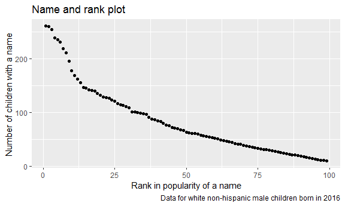

P8105\_hw2\_jf3286.Rmd
================
Jingyu Fu
2019/9/26

# Problem 1

## Read and clean the Mr. Trash Wheel sheet

``` r
library(readxl)
Mr_Trash_Wheel_data = read_excel("./data/Trash-Wheel-Collection-Totals-8-6-19.xlsx", sheet = "Mr. Trash Wheel", range = "A2:N408", col_names = TRUE) %>%
  janitor::clean_names()%>%
   rename (total_weight_tons = weight_tons,  total_volume_cubic_yards = volume_cubic_yards)%>%
   drop_na (dumpster) %>% 
   mutate(
    sports_balls = round(sports_balls, digits = 0),
    sports_balls = as.integer(sports_balls)
  ) 
Mr_Trash_Wheel_data
```

    ## # A tibble: 344 x 14
    ##    dumpster month  year date                total_weight_to~
    ##       <dbl> <chr> <dbl> <dttm>                         <dbl>
    ##  1        1 May    2014 2014-05-16 00:00:00             4.31
    ##  2        2 May    2014 2014-05-16 00:00:00             2.74
    ##  3        3 May    2014 2014-05-16 00:00:00             3.45
    ##  4        4 May    2014 2014-05-17 00:00:00             3.1 
    ##  5        5 May    2014 2014-05-17 00:00:00             4.06
    ##  6        6 May    2014 2014-05-20 00:00:00             2.71
    ##  7        7 May    2014 2014-05-21 00:00:00             1.91
    ##  8        8 May    2014 2014-05-28 00:00:00             3.7 
    ##  9        9 June   2014 2014-06-05 00:00:00             2.52
    ## 10       10 June   2014 2014-06-11 00:00:00             3.76
    ## # ... with 334 more rows, and 9 more variables:
    ## #   total_volume_cubic_yards <dbl>, plastic_bottles <dbl>,
    ## #   polystyrene <dbl>, cigarette_butts <dbl>, glass_bottles <dbl>,
    ## #   grocery_bags <dbl>, chip_bags <dbl>, sports_balls <int>,
    ## #   homes_powered <dbl>

## Read and clean precipitation data for 2017 and 2018.

``` r
 precipitation_2017 = read_excel("./data/Trash-Wheel-Collection-Totals-8-6-19.xlsx", sheet = "2017 Precipitation", skip = 1, col_names = TRUE) %>% 
    janitor::clean_names() %>% 
    drop_na ()%>%
   mutate (year = 2017) %>% 
   select (year,everything())
 
 precipitation_2018 = read_excel("./data/Trash-Wheel-Collection-Totals-8-6-19.xlsx", sheet = "2018 Precipitation", skip = 1, col_names = TRUE) %>% 
    janitor::clean_names()%>%
    drop_na ()%>%
   mutate (year = 2018) %>% 
   select (year,everything())
 precipitation_2017
```

    ## # A tibble: 12 x 3
    ##     year month total
    ##    <dbl> <dbl> <dbl>
    ##  1  2017     1  2.34
    ##  2  2017     2  1.46
    ##  3  2017     3  3.57
    ##  4  2017     4  3.99
    ##  5  2017     5  5.64
    ##  6  2017     6  1.4 
    ##  7  2017     7  7.09
    ##  8  2017     8  4.44
    ##  9  2017     9  1.95
    ## 10  2017    10  0   
    ## 11  2017    11  0.11
    ## 12  2017    12  0.94

## Next, combine precipitation datasets.

``` r
 combination_precipitation = full_join (precipitation_2017,precipitation_2018) %>% 
   mutate (
     month = as.numeric (month),
     month = month.name [month]
     
   )
```

    ## Joining, by = c("year", "month", "total")

``` r
combination_precipitation
```

    ## # A tibble: 24 x 3
    ##     year month     total
    ##    <dbl> <chr>     <dbl>
    ##  1  2017 January    2.34
    ##  2  2017 February   1.46
    ##  3  2017 March      3.57
    ##  4  2017 April      3.99
    ##  5  2017 May        5.64
    ##  6  2017 June       1.4 
    ##  7  2017 July       7.09
    ##  8  2017 August     4.44
    ##  9  2017 September  1.95
    ## 10  2017 October    0   
    ## # ... with 14 more rows

## Write a paragraph about these data.

The total precipitation in 2018 is 70.33.The median number of sports
balls in a dumpster in 2017 is 8.

In Mr\_Trash\_Wheel\_data, there are 344rows and 14columns, and the key
variable is dumpster, which identifies each row.

In combination\_precipitation\_data,there are 344rows and 14columns, and
the key variable is month, which is the link between precipitation 2017
data and precipitation 2018 data.

In precipitation\_2017 data, there are 12rows and 3columns.The mean is
2.7441667.The key variable is month, because the month identifies each
row.

In the precipitation\_2018 data, there are 12rows and 3columns. The mean
is 5.8608333.The key variable is month, because the month identifies
each
row.

# Problem 2

## First, clean the data in pols-month.csv.

``` r
pols_month = read_csv(file = "./data/fivethirtyeight_datasets/pols-month.csv", col_names = TRUE)%>%
  janitor:: clean_names () %>% 
  separate (mon, into = c("year", "month", "day"), convert=T) %>% 
  mutate(
    month = as.numeric (month), 
    month = month.name [month],
    president = ifelse (prez_gop == 0, "dem","gop")
  ) %>% 
  select(- prez_dem, - prez_gop, -day)
```

    ## Parsed with column specification:
    ## cols(
    ##   mon = col_date(format = ""),
    ##   prez_gop = col_double(),
    ##   gov_gop = col_double(),
    ##   sen_gop = col_double(),
    ##   rep_gop = col_double(),
    ##   prez_dem = col_double(),
    ##   gov_dem = col_double(),
    ##   sen_dem = col_double(),
    ##   rep_dem = col_double()
    ## )

``` r
pols_month
```

    ## # A tibble: 822 x 9
    ##     year month    gov_gop sen_gop rep_gop gov_dem sen_dem rep_dem president
    ##    <int> <chr>      <dbl>   <dbl>   <dbl>   <dbl>   <dbl>   <dbl> <chr>    
    ##  1  1947 January       23      51     253      23      45     198 dem      
    ##  2  1947 February      23      51     253      23      45     198 dem      
    ##  3  1947 March         23      51     253      23      45     198 dem      
    ##  4  1947 April         23      51     253      23      45     198 dem      
    ##  5  1947 May           23      51     253      23      45     198 dem      
    ##  6  1947 June          23      51     253      23      45     198 dem      
    ##  7  1947 July          23      51     253      23      45     198 dem      
    ##  8  1947 August        23      51     253      23      45     198 dem      
    ##  9  1947 Septemb~      23      51     253      23      45     198 dem      
    ## 10  1947 October       23      51     253      23      45     198 dem      
    ## # ... with 812 more rows

## Second, clean the data in snp.csv.

``` r
snp = read_csv(file = "./data/fivethirtyeight_datasets/snp.csv") %>% 
janitor:: clean_names () %>% 
  separate (date, into = c( "month", "day","year"), convert=T) %>% 
  arrange (year, month) %>% 
  select (year, month, everything (),-day) %>% 
  mutate(
    month = as.numeric (month), 
    month = month.name [month]
  ) 
```

    ## Parsed with column specification:
    ## cols(
    ##   date = col_character(),
    ##   close = col_double()
    ## )

``` r
snp
```

    ## # A tibble: 787 x 3
    ##     year month     close
    ##    <int> <chr>     <dbl>
    ##  1  1950 January    17.0
    ##  2  1950 February   17.2
    ##  3  1950 March      17.3
    ##  4  1950 April      18.0
    ##  5  1950 May        18.8
    ##  6  1950 June       17.7
    ##  7  1950 July       17.8
    ##  8  1950 August     18.4
    ##  9  1950 September  19.5
    ## 10  1950 October    19.5
    ## # ... with 777 more rows

## Third, tidy the unemployment data.

``` r
unemployment = read_csv(file = "./data/fivethirtyeight_datasets/unemployment.csv") %>% 
  pivot_longer (
  Jan:Dec, 
  names_to = "month",
  values_to = "number"
              ) %>% 
janitor:: clean_names () 
```

    ## Parsed with column specification:
    ## cols(
    ##   Year = col_double(),
    ##   Jan = col_double(),
    ##   Feb = col_double(),
    ##   Mar = col_double(),
    ##   Apr = col_double(),
    ##   May = col_double(),
    ##   Jun = col_double(),
    ##   Jul = col_double(),
    ##   Aug = col_double(),
    ##   Sep = col_double(),
    ##   Oct = col_double(),
    ##   Nov = col_double(),
    ##   Dec = col_double()
    ## )

``` r
unemployment
```

    ## # A tibble: 816 x 3
    ##     year month number
    ##    <dbl> <chr>  <dbl>
    ##  1  1948 Jan      3.4
    ##  2  1948 Feb      3.8
    ##  3  1948 Mar      4  
    ##  4  1948 Apr      3.9
    ##  5  1948 May      3.5
    ##  6  1948 Jun      3.6
    ##  7  1948 Jul      3.6
    ##  8  1948 Aug      3.9
    ##  9  1948 Sep      3.8
    ## 10  1948 Oct      3.7
    ## # ... with 806 more rows

## Join the datasets.

``` r
join_datasets = 
  left_join (pols_month, snp, by = c ("year","month")) %>% 
    left_join (unemployment,by = c ("year","month"))
join_datasets
```

    ## # A tibble: 822 x 11
    ##     year month gov_gop sen_gop rep_gop gov_dem sen_dem rep_dem president
    ##    <dbl> <chr>   <dbl>   <dbl>   <dbl>   <dbl>   <dbl>   <dbl> <chr>    
    ##  1  1947 Janu~      23      51     253      23      45     198 dem      
    ##  2  1947 Febr~      23      51     253      23      45     198 dem      
    ##  3  1947 March      23      51     253      23      45     198 dem      
    ##  4  1947 April      23      51     253      23      45     198 dem      
    ##  5  1947 May        23      51     253      23      45     198 dem      
    ##  6  1947 June       23      51     253      23      45     198 dem      
    ##  7  1947 July       23      51     253      23      45     198 dem      
    ##  8  1947 Augu~      23      51     253      23      45     198 dem      
    ##  9  1947 Sept~      23      51     253      23      45     198 dem      
    ## 10  1947 Octo~      23      51     253      23      45     198 dem      
    ## # ... with 812 more rows, and 2 more variables: close <dbl>, number <dbl>

## Write a short paragraph about these datasets.

In pols-month.csv , there contained the date, and corresponding
information about president government. For its resulting dataset, there
are 822 rows and 9 columns, range of year is1947, 2015, and the key
variable is date, which identifies each row. In snp.csv , there
contained the date, and corresponding information about president
government. For its resulting dataset, there are 787 rows and 3 columns,
range of year is1950, 2015, and the key variables are year, month and
day, which together identifies each row. In unemployment.csv , there
contained the date, and corresponding information about president
government. For its resulting dataset, there are 816 rows and 3 columns,
range of year is1948, 2015, and the key variables are year and month,
which together identify each row.

# Problem 3

## Load and tidy the data.

``` r
library(ggridges)
```

    ## 
    ## Attaching package: 'ggridges'

    ## The following object is masked from 'package:ggplot2':
    ## 
    ##     scale_discrete_manual

``` r
library(dplyr)
popular_baby_names = read_csv (file = "./data/Popular_Baby_Names.csv", col_names = TRUE, col_types = "ncccnn")%>%
  janitor::clean_names()%>%
  distinct(.keep_all = TRUE)
popular_baby_names
```

    ## # A tibble: 12,181 x 6
    ##    year_of_birth gender ethnicity              childs_first_na~ count  rank
    ##            <dbl> <chr>  <chr>                  <chr>            <dbl> <dbl>
    ##  1          2016 FEMALE ASIAN AND PACIFIC ISL~ Olivia             172     1
    ##  2          2016 FEMALE ASIAN AND PACIFIC ISL~ Chloe              112     2
    ##  3          2016 FEMALE ASIAN AND PACIFIC ISL~ Sophia             104     3
    ##  4          2016 FEMALE ASIAN AND PACIFIC ISL~ Emily               99     4
    ##  5          2016 FEMALE ASIAN AND PACIFIC ISL~ Emma                99     4
    ##  6          2016 FEMALE ASIAN AND PACIFIC ISL~ Mia                 79     5
    ##  7          2016 FEMALE ASIAN AND PACIFIC ISL~ Charlotte           59     6
    ##  8          2016 FEMALE ASIAN AND PACIFIC ISL~ Sarah               57     7
    ##  9          2016 FEMALE ASIAN AND PACIFIC ISL~ Isabella            56     8
    ## 10          2016 FEMALE ASIAN AND PACIFIC ISL~ Hannah              56     8
    ## # ... with 12,171 more rows

## Produce a table showing the rank in popularity of the name “Olivia” as a female baby name over time.

``` r
  popular_baby_names_1 = 
    select (popular_baby_names, - count)%>%
  filter (gender == "FEMALE" & childs_first_name == "Olivia")%>%
  pivot_wider(names_from = "year_of_birth", values_from = "rank")%>%
  select (- gender, - childs_first_name)
  knitr::kable(popular_baby_names_1)
```

| ethnicity                  | 2016 | 2015 | 2014 | 2013 |
| :------------------------- | ---: | ---: | ---: | ---: |
| ASIAN AND PACIFIC ISLANDER |    1 |    1 |    1 |    3 |
| BLACK NON HISPANIC         |    8 |    4 |    8 |    6 |
| HISPANIC                   |   13 |   16 |   16 |   22 |
| WHITE NON HISPANIC         |    1 |    1 |    1 |    1 |

## Produce a similar table showing the most popular name among male children over time.

``` r
 popular_baby_names_2 =
  filter (popular_baby_names, gender %in% c ("MALE") & rank == 1 )%>%
  select (- count, - gender)%>%
  pivot_wider(names_from = "year_of_birth", values_from = "childs_first_name")%>%
   select (- rank) %>% 
   drop_na()
 knitr::kable(popular_baby_names_2)
```

| ethnicity | 2016 | 2015 | 2014 | 2013   | 2012   | 2011   |
| :-------- | :--- | :--- | :--- | :----- | :----- | :----- |
| HISPANIC  | Liam | Liam | Liam | Jayden | JAYDEN | JAYDEN |

## Finally, produce a scatter plot for male, white non-hispanic children born in 2016.

``` r
 ggplot_data = 
   filter (popular_baby_names, gender == "MALE" & ethnicity == "WHITE NON HISPANIC" & year_of_birth == 2016) 

  ggplot(ggplot_data, aes(x = rank, y = count)) + 
    geom_point()+
 labs(
    title = "Name and rank plot  ",
    x = "Rank in popularity of a name",
    y = "Number of children with a name ",
    caption = "Data for white non-hispanic male children born in 2016"
  )
```


